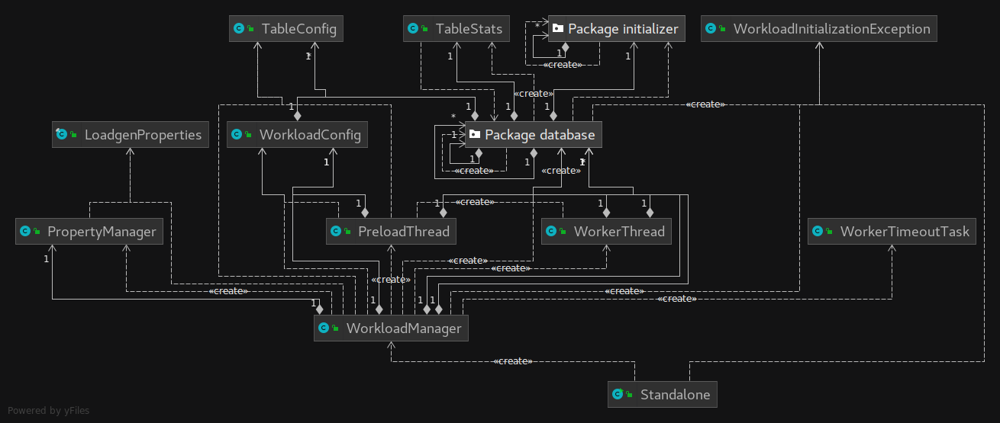
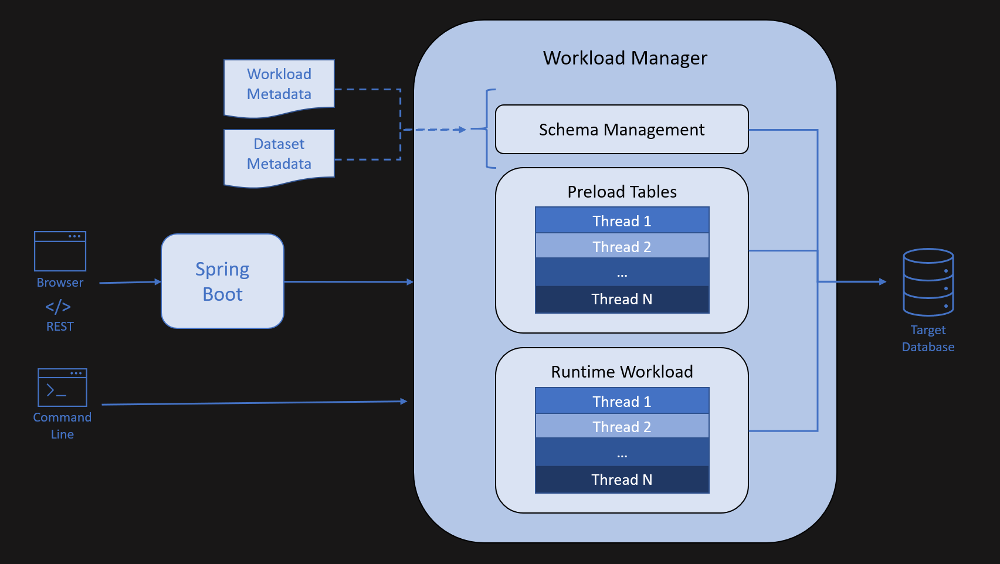
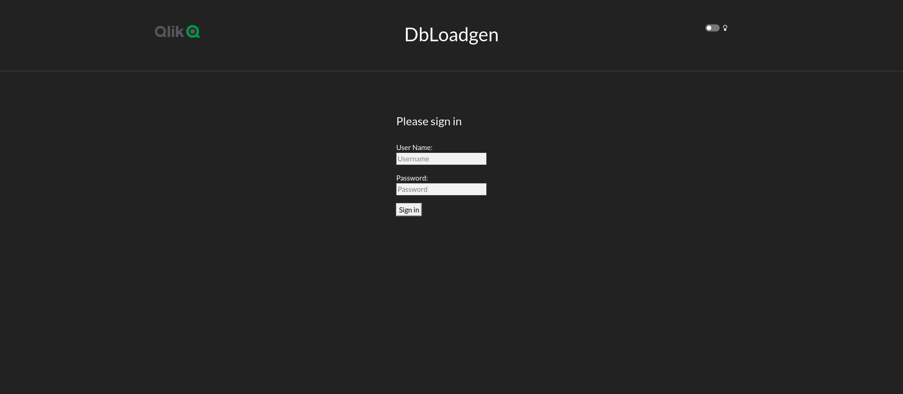
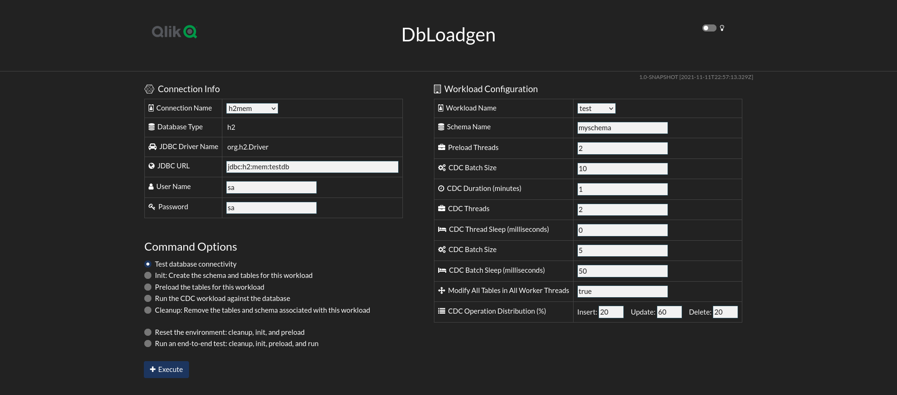
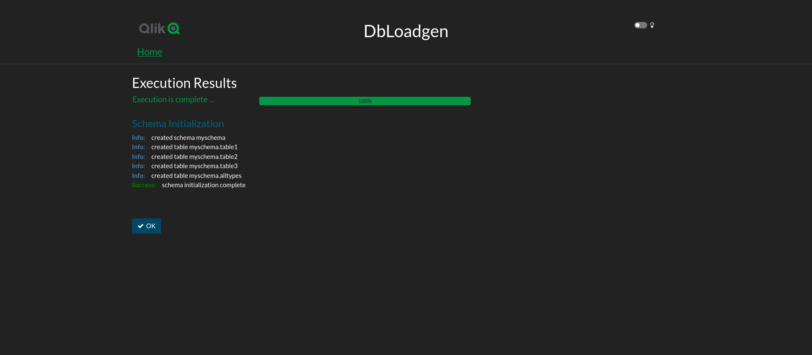
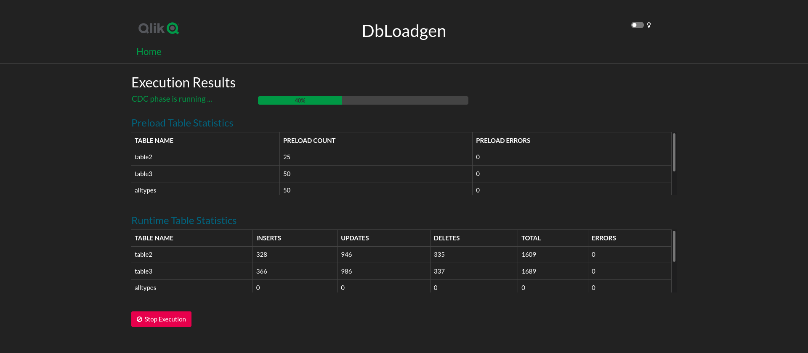

# DbLoadgen: A Scalable Solution for Generating Transactional Load Against a Database

DbLoadgen is scalable solution for generating transactional loads against a database,
perhaps most useful for testing CDC tools such as Qlik Replicate. Focus is on generating
a random series of INSERT, UPDATE, and DELETE statements across the tables that make up
the dataset being tested, not in generating a true OLTP-load as one might see in an
implementation of a benchmark such as TPC-C.

DbLoadgen is somewhat different from other open-source tools that can be found in that it
is designed to be extremely flexible. In particular:

* DbLoadgen is metadata-driven, meaning that all the data structures 
associated with managing the workload and defining the tables to be used in 
testing are created from yaml-based files. 

* All SQL is generated on the fly from the meta-data files rather than relying on 
canned scripts for creating the tables used in testing. This makes adding support 
for additional target databases and/or additional datasets for testing much easier.

* As with any of the load generation and benchmarking tools that are available on the internet,
DbLoadgen generates random values to use in populating table rows. DbLoadgen is different in 
that it allows specification of custom initializers for each column, allowing the data
that is generated to have a more meaningful appearance when the data in the database 
is queried. For example, integer values can be limited to a particular range on a 
column-by-column basis, and patterns may be specified to generate values that look like
real-life content such as social security numbers, credit card numbers, etc.

## DbLoadgen Architecture

DbLoadgen is written in Java and provides several mechanisms for configuring and initiating workloads:

* Controlling a workload directly from the command line
* Starting and controlling a workload using an HTML- and JavaScript-based GUI.

This image represents a high-level view of the object model for the workload manager.

 

This image represents the DbLoadgen process architecture as it relates to 
interacting with a target database.

 


## Supported Databases

As mentioned earlier, DbLoadgen was designed to support a variety of database targets:

* H2: An in-memory database useful for low volume testing of configurations, etc.
* MySQL 
* SQL Server
* PostgreSQL
* Oracle - Oracle 12c and up

Other databases can be added without much difficulty. All that is required is creating a 
class that extends the base class `qlikpe.dbloadgen.model.database.Database`. This class
is responsible for generating the appropriate SQL dialect for the target database.

## DbLoadgen Configuration

### Workload Metadata

A workload metadata file is used to configure the execution of a test. It defines
items such as the number of worker threads; the dataset and associated tables to 
use; the duration of the test; and more. The metadata is expressed in YAML format as 
shown in the following example. Note that all properties are required. The tables 
section identifies a list of tables that should be part of the test.

```yaml
!!qlikpe.dbloadgen.model.workload.WorkloadConfig
name: myname
dataset: test           
schema: myschema        
duration: 1
workerThreads: 2
preloadThreads: 2
preloadBatchSize: 10
workerBatchSize: 5
workerBatchSleep: 50
workerThreadSleep: 0
allTablesAllThreads: true
operationPct:
   insert: 25
   update: 50
   delete: 25
tables:
   - name: table1
     preload: data
     updateColumns: "G,W,L"
     operationPct:
       insert: 80
       update: 15
       delete: 5
   - name: table2
     preload: data
     updateColumns: "active,NAassoc"
   - name: table3
     preload: "21"
     updateColumns: "active"
```

* **dataset**: the name of the subdirectory where the table metadata can be found
* **schema**: the name of the schema in the target database where the tables
should be created.
* **duration**: 
  * \> 0: the number of **minutes** that the workload should run after initialization.
  * < 0: the number of **days** that the workload should run after initialization.
  * 0: use the default duration of 10 minutes.
* **workerThreads**: the number of independent threads to spin up for generating load during
the test.
* **preloadThreads**: the number of threads to have running in parallel during database
initialization. A thread is responsible for loading a table. When a table has been 
initialized, the thread will terminate and another thread will take its place to load
the next table, and so on until all tables have been initialized.
* **preloadBatchSize**: the size of each batch of inserts to a table during the preload phase.
* **workerBatchSize**: the number of random operations (insert/update/delete) that should
be generated before each worker thread commits a transaction.
* **workerBatchSleep**: specifies the length of time in milliseconds to sleep after applying
each batch of operations to the database.
* **workerThreadSleep**: specifies the length of time in milliseconds to sleep between each
operation that is generated. Specifying a non-zero value here can significantly reduce the 
number of operations generated. This can be quite useful for demos and functional tests where
high volume testing is not necessarily required.
* **allTablesAllThreads**: 
  * a value of `true` specifies that all tables should be accessed
and updated from each worker thread. In this mode, transaction volume against each table 
will be somewhat higher, but the possibility of transaction deadlock / operation collisions 
will exist. When they occur, these errors are caught and handled by DbLoadgen. 
  * A value of `false` will cause each table to be allocated to only a single worker thread.
* **operationPct**: specifies the distribution of randomly generated 
INSERT, UPDATE, and DELETE operations.
* **tables**: this is a YAML "list" that identifies the specific tables from the dataset
subdirectory that we want to be a part of this test. This list might include only
a subset of tables from the directory, or all of the tables.
  * **name**: the name of the table
  * **preload**: identifies the source of the data to use to preload each table. The value may
be *data*, which indicates that the initialization data can be found in the *data* section
of the table metadata, or it may be an integer which will indicate the number of rows to 
generate automatically. If the value is an integer, then the data section in the table metadata
is ignored even if it is present.
  * **updateColumns**: the name(s) of the column(s) that should be modified as a part of
any update operations. New values for these columns will be randomly generated. Note
that if *updateColumns* is empty, then the table will be loaded, but omitted from participation
in random generation of CDC load.
  * **operationPct**: optionally, you can specify the distribution of operations on a
table-by-table basis. If not specified, the distribution of operations for a table will
be based on the values specified for the workload as described above.

### Table Metadata

Table metadata files are part of a "dataset" and are located in a subdirectory 
with the same name as the *dataset* that was specified in the workload configuration 
file.  A table metadata file is used to define the structure of a table, the initializer
type that should be used to generate values for each column, columns that should
make up the primary key, etc. The metadata is specified in YAML format as shown in 
the following example. Note that the *name* and *type* properties are required. *Nullable* and 
*initializer* are optional.
```yaml
!!qlikpe.dbloadgen.model.database.Table
name: table1
columns:
  - name: yearID
    type: int(11)
    nullable: false
    initializer: "SignedInteger,1890,2021"
  - name: lgID
    type: varchar(64)
    nullable: false
    initializer: "RandomString,ALPHA,10"
  - name: teamID
    type: varchar(64)
    nullable: false
    initializer: "RandomString,ALPHA,10"
  - name: HalfID
    type: int(11)
    nullable: false
    initializer: "SignedInteger"
  - name: divID
    type: varchar(64)
    nullable: false
    initializer: "RandomString,ALPHA,10"
  - name: DivWin
    type: varchar(64)
    nullable: true
    initializer: "RandomString,ALPHA,10"
  - name: Rank
    type: int(11)
    nullable: true
    initializer: "SignedInteger,0,100"
  - name: G
    type: int(11)
    nullable: true
    initializer: "SignedInteger"
  - name: W
    type: int(11)
    nullable: true
    initializer: "SignedInteger"
  - name: L
    type: int(11)
    nullable: true
    initializer: "SignedInteger"
keyColumns:
  - yearID
  - lgID
  - teamID
  - HalfID
  - divID
data:
  - "'1981', 'NL', 'ATL', '1', 'W', 'N', '4', '54', '25', '29'"
  - "'1981', 'NL', 'ATL', '2', 'W', 'N', '5', '52', '25', '27'"
  - "'1981', 'AL', 'BAL', '1', 'E', 'N', '2', '54', '31', '23'"
  - "'1981', 'AL', 'BAL', '2', 'E', 'N', '4', '51', '28', '23'"
  - "'1981', 'AL', 'BOS', '1', 'E', 'N', '5', '56', '30', '26'"
  - "'1981', 'AL', 'BOS', '2', 'E', 'N', '2', '52', '29', '23'"
  - "'1981', 'AL', 'CAL', '1', 'W', 'N', '4', '60', '31', '29'"
  - "'1981', 'AL', 'CAL', '2', 'W', 'N', '6', '50', '20', '30'"
  - "'1981', 'AL', 'CHA', '1', 'W', 'N', '3', '53', '31', '22'"
  - "'1981', 'AL', 'CHA', '2', 'W', 'N', '6', '53', '23', '30'"
  - "'1981', 'NL', 'CHN', '1', 'E', 'N', '6', '52', '15', '37'"
  - "'1981', 'NL', 'CHN', '2', 'E', 'N', '5', '51', '23', '28'"
  - "'1981', 'NL', 'CIN', '1', 'W', 'N', '2', '56', '35', '21'"
  - "'1981', 'NL', 'CIN', '2', 'W', 'N', '2', '52', '31', '21'"
  - "'1981', 'AL', 'CLE', '1', 'E', 'N', '6', '50', '26', '24'"
  - "'1981', 'AL', 'CLE', '2', 'E', 'N', '5', '53', '26', '27'"
  - "'1981', 'AL', 'DET', '1', 'E', 'N', '4', '57', '31', '26'"
  - "'1981', 'AL', 'DET', '2', 'E', 'N', '2', '52', '29', '23'"
  - "'1981', 'NL', 'HOU', '1', 'W', 'N', '3', '57', '28', '29'"
  - "'1981', 'NL', 'HOU', '2', 'W', 'N', '1', '53', '33', '20'"
  - "'1981', 'AL', 'KCA', '1', 'W', 'N', '5', '50', '20', '30'"
  - "'1981', 'AL', 'KCA', '2', 'W', 'N', '1', '53', '30', '23'"
  - "'1981', 'NL', 'LAN', '1', 'W', 'N', '1', '57', '36', '21'"
  - "'1981', 'NL', 'LAN', '2', 'W', 'N', '4', '53', '27', '26'"
  - "'1981', 'AL', 'MIN', '1', 'W', 'N', '7', '56', '17', '39'"
```

* **name**: the name of the table. 
* **columns**: a YAML list of column-related information
  * **name**: the column name. Column names are obviously required.
  * **type**: the data type for the column (see *Column Data Types* below). A column data type
must be specified.
  * **nullable**: a Boolean (true/false) indicating whether the column should
be nullable. This field is optional.
  * **initializer**: the type of initializer that should be associated with this column.
Initializers generate values to assign to the columns when rows are inserted, or
when update operations are executed. See *Column Initializers* below. Specification of
an initializer for a column is optional. If you do not specify one, DbLoadgen will use
a default initializer specific to that column's data type.
* **keyColumns**: a YAML list of column names that will make up the primary key for the table.
If no columns are specified or if *keyColumns* is absent, then an auto incrementing 
column named *id_* will be generated in the DDL.
* **data**: an array of comma-delimited YAML strings that indicate the values 
that should be used to initialize the table. Pay attention to the format here ... each line
is surrounded by double quotes, and each value by single quotes. There must be a value
for each column in the table. Specification of this field is optional.

### Column Data Types

Since data types that are supported can vary by database, DbLoadgen uses an abstracted set
of "generic" data types that it then maps tables to the target database. Specify these 
types in the *table.yml* files that define a table's metadata. Not every database supports the
idea of an unsigned integer ... in those cases, unsigned generic types are mapped to
their signed counterparts.

* **CHAR(length)**: A fixed length character string.
* **NCHAR(length)**: A fixed length multibyte character string.
* **VARCHAR(length)**: A variable length character string.
* **NVARCHAR(length)**: A variable length multibyte character string.
* **BOOLEAN**: a Boolean column (true/false).
* **BYTES(length)**: A fixed length array of binary data.
* **VARBYTES(length)**: A variable length array of binary data.
* **DATE**: A date in the form of *YYYY-MM-DD*
* **TIME**: A time value of the form *HH:mm:ss*
* **DATETIME**: A timestamp-like value of the form *YYYY-MM-DD HH:mm:ss*
* **INT1**: A single byte signed integer (a MySQL "tinyint").
* **INT2**: A double byte signed integer (a MySQL "smallint").
* **INT3**: A 3-byte signed integer (a MySQL "mediumint").
* **INT4**: A 4-byte signed integer (a MySQL "int").
* **INT8**: An 8-byte signed integer (a MySQL "bigint").
* **NUMERIC(precision,scale)**: A fixed decimal number of the specified precision and scale.
* **FLOAT**: A single precision binary floating point number.
* **DOUBLE**: A double precision binary floating point number.
* **UINT1**: A single byte unsigned integer (a MySQL "unsigned tinyint").
* **UINT2**: A double byte unsigned integer (a MySQL "unsigned smallint").
* **UINT3**: A 3-byte unsigned integer (a MySQL "unsigned mediumint").
* **UINT4**: A 4-byte unsigned integer (a MySQL "unsigned int").
* **UINT8**: An 8-byte unsigned integer (a MySQL "unsigned bigint").
* **BLOB**: A binary large object. Generated BLOBs are 4k by default unless 
overridden by a column initializer.
* **CLOB**: A character large object. Generated CLOBs are 4k by default unless 
overridden by a column initializer.
* **NCLOB**: A multibyte character large object. Generated NCLOBs are 4k by default unless 
overridden by a column initializer.

### Column Initializers

There are quite a few initializers that may be used to generate column values during insert
and update operations. Initializers and their associated arguments that define their behavior
are specified as YAML strings containing comma-delimited values in the table metadata.

For example: `initializer: "SignedInteger,1890,2021"` says to generate a random integer
with a value between 1890 and 2021. **Note that initializer names are case-sensitive.**

* **RandomString**: return a random string. All characters in the string are
randomly selected. This is suitable for use in key columns.
  * Usage: RandomString - generate an alphanumeric string of length 10. 
  * Usage: RandomString,*length* - generate an alphanumeric string of the specified length. 
  * RandomString,*type*,*length* - generate a string of the specified length where type is one of
     * UPPER: generate an uppercase string
     * LOWER: generate a lowercase string
     * ALPHA: generate a string containing uppercase and lowercase letters
     * NUMBERS: generate a string containing only numbers
     * ALL: generate a string containing all characters
* **FixedString**: generate a string of fixed length.  Relatively efficient but not terribly random.
Not suitable for use in a key column.
  * Usage: FixedString - generate a string of the default length of 10
  * Usage: FixedString,*length* - generate a string of the specified length
* **RandomBytes**: generate an array of bytes to assign to a binary column value.  
Relatively efficient but not terribly random.  Not suitable for use in a key column.
  * Usage: RandomBytes - generate a string of the default length of 10
  * usage: RandomBytes,*length* - generate a string of the specified length
* **Pattern**: generate a random value based on the specified *template*.  A *template* 
is a string that describes how the data should appear. For example, a credit card number
might be defined as `####-####-####-####`. Subpatterns are defined as follows, and if a character
is used in sequence as in the credit card number example, they are treated as a single subpattern:
  * Usage: Pattern,*template*: 
    * **#**: a numeric value.
    * **@**: a lowercase alphabetic character.
    * **^**: an uppercase alphabetic character.
    * **%**: a random alphanumeric character.
    * **\***: any random character.
    * any other characters are treated as a literal.
    * the characters that are used to define subpatterns (#,@,^,%,\*) may be 
escaped with a double backslash ("\\\\") to force them to be taken literally.
* **SSN**: return a random string formatted like a US social security number. This is an 
example of implementing a specialized type derived from *Pattern*.
  * Usage: SSN
* **PaddedInteger**: return a random integer padded on the left with zeros if necessary.
  * Usage: PaddedInteger,*length*
* **UnsignedInteger**: return a random integer value >= zero
  * Usage: UnsignedInteger - any random integer >= zero 
  * Usage: UnsignedInteger,min,max - a random integer in the specified range 
where min is inclusive, max is exclusive and min must be greater than or equal to zero 
* **SignedInteger**: return a random integer
  * Usage: SignedInteger - any random integer 
  * Usage: SignedInteger,min,max - a random integer in the specified range 
where min is inclusive, max is exclusive. 
* **SignedLong**: return a random long
  * Usage: SignedLong - any random long 
  * Usage: SignedLong,min,max - a random long in the specified range where min is inclusive, 
max is exclusive and min must be greater than or equal to zero 
* **RandomDecimal**: return a random decimal number
  * Usage: RandomDecimal - defaults to precision(8), scale(2), min(0), max(max value)
  * Usage: RandomDecimal,*precision*,*scale* - defaults to min(0), max(max value)
  * Usage:RandomDecimal,*precision*,*scale*,*min*,*max*
* **Literal**: always return the specified literal
  * Usage: Literal,*string* - the string to return
* **LiteralArray**: return a random value from the specified array
  * Usage: LiteralArray,*value 1*,*value 2*,...,*value N*
* **RandomDate**: return a random date from the last 10 years of the form *YYYY-MM-DD*.
  * Usage: RandomDate
* **RandomTime**: return a random time of day of the form *HH:mm:ss*.
  * Usage: RandomTime
* **DateTime**: return a timestamp value of the form *YYYY-MM-DD HH:mm:ss*.
  * Usage: DateTime

More initializers can be created if the need arises.

## Specifying database connections
You can specify connections to the various databases you might want to connect to in
a file called *connections.yml* in your *datasets* directory. You can then reference
these connections by name from the command line or in the GUI.

```yaml
!!qlikpe.dbloadgen.model.workload.DbLoadgenConnectionList
connections:
   - name: h2mem
     databaseType: h2
     jdbcDriver: org.h2.Driver
     url: jdbc:h2:mem:testdb
     username: sa
     password: sa
   - name: mysqltest
     databaseType: mysql
     jdbcDriver: com.mysql.cj.jdbc.Driver
     url: jdbc:mysql://localhost:3306
     username: root
     password: attunity
   - name: postgrestest
     databaseType: postgres
     jdbcDriver: org.postgresql.Driver
     url: jdbc:postgresql://localhost:5432/qlikdb
     username: qlik
     password: attunity
   - name: sqltest
     databaseType: sqlserver
     jdbcDriver: com.microsoft.sqlserver.jdbc.SQLServerDriver
     url: jdbc:sqlserver://localhost:1433
     username: sa
     password: AttunityAdmin123
   - name: oratest
     databaseType: oracle
     jdbcDriver: oracle.jdbc.driver.OracleDriver
     url: jdbc:oracle:thin:@localhost:1521/XEPDB1
     username: c##attunity
     password: attunity
```
All fields are required:

* **name**: is the name of the connection as referred to on the command line 
* **databaseType**: specifies the database dialect to use.
* **jdbcDriver**: specifies the JDBC driver entry point for this database.
* **url**: this is the database connection URL. It is used verbatim.
* **username**: the database username to connect with. This user must have sufficient 
privileges to create schemas and tables, as well as read and write them.
* **password**: the password of the database user.

## Command Line Execution

There are many command line options when executing DbLoadgen:

```
[dbloadgen]$ ./dbloadgen.sh -h
usage: DbLoadgenCLI [-h] [--dataset-dir DATASET_DIRECTORY] [--workload-config DATASET]
                    [--connection-list CONNECTION_LIST] [--connection-name CONNECTION_NAME]
                    [--user USER_NAME] [--password PASSWORD] [--url JDBC_URL]
                    [--jdbc-driver JDBC_DRIVER] [--database-type DATABASE_TYPE]
                    [--properties-file PROPERTIES_FILE] COMMAND

This utility generates user-configurable loads against a database.

positional arguments:
  COMMAND                The runtime command to execute: [test-connection, preload, help-commands,
                         end-to-end, help-initializers, cleanup, list-connections, reset, 
                         list-workloads, run, init]

named arguments:
  -h, --help             show this help message and exit
  --dataset-dir DATASET_DIRECTORY
                         The directory where the source dataset(s) are stored
  --workload-config DATASET
                         The name of the runtime workload configuration yaml file to use. This
                         should be located in the DATA_DIRECTORY.
  --connection-list CONNECTION_LIST
                         The name of yaml file that contains a list of database connections that
                         have been defiled. This should be located in the DATA_DIRECTORY.
  --connection-name CONNECTION_NAME
                         The name of the connection from the connection yaml to use.
  --user USER_NAME       The database username.
  --password PASSWORD    The password for the database user
  --url JDBC_URL         The database JDBC connection URL.
  --jdbc-driver JDBC_DRIVER
                         The fully qualified database driver class
  --database-type DATABASE_TYPE
                         The type of database: [h2, mysql, postgres, oracle, sqlserver]
  --properties-file PROPERTIES_FILE
                         The path to a properties file where these options may also be set

COMMAND reference:

   test-connection      - test database connectivity
   init                 - create the schema and tables for this workload
   preload              - preload the tables for this workload
   run                  - run the CDC load against the database
   cleanup              - remove the workload's tables and associated schema from the database
   end-to-end           - run an end-to-end test: cleanup, init, preload, and run
   reset                - perform a `cleanup', followed by an 'init' and 'preload'
   help-initializers    - print a brief description of the available column initializers
   list-connections     - list database connections that have been defined
   list-workloads       - list workload configurations that are available to the app.
   help-commands        - print this brief description of COMMAND options
[dbloadgen]$
```

## Running the DbLoadgen Server

In addition to command line-based execution of workloads, workloads can also be configured and 
executed using the DbLoadgen Server. The server was developed using Spring Boot.

> **Regarding Spring Boot**: Spring Boot provides a backend server that can support 
interactions with many users.
DbLoadgen could in theory do this as a result, but its current design calls for
there to be a single user running a single workload at any point in time.
The reason for this is that the process of preloading a database and generating
transactions makes use of a configurable pool of threads;
more threads translate to more transaction volume. It would be easy to overwhelm a server
if multiple high-volume workloads were running at one time.

### Running the Server from the Command Line

You can run the server from the command line as follows:

```shell
PORT="9090"
DATASETS="./datasets"
GUIUSER="admin"
PASSWORD="admin"
DBLOADGENSERVER_JAR="location-of-the-server-jar"

java -Dfile.encoding=UTF-8  -Doracle.jdbc.javaNetNio=false \
   -XX:TieredStopAtLevel=1 \
   -noverify \
   -Dspring.output.ansi.enabled=always \
   -Dcom.sun.management.jmxremote \
   -Dspring.jmx.enabled=true \
   -Dspring.liveBeansView.mbeanDomain \
   -Dspring.application.admin.enabled=true \
   -Dfile.encoding=UTF-8 \
   -jar "${DBLOADGENSERVER_JAR}" \
   --dbloadgen.directory="${DATASETS}" \
   --spring.security.user.name="${GUIUSER}" \
   --spring.security.user.password="${PASSWORD}" \
   --server.port="${PORT}" \
   --management.server.port="${PORT}"
```

There are also convenience scripts provided for Linux (**dbloadgenserver.sh**)
and Windows (**dbloadgenserver.bat**).

See the following section on [Using Docker](#Using-Docker) for information on how to run the server as a
Docker image directly from the command line or using Docker Compose.

### Connecting via a web browser

You can access DbLoadgen via any standard web browser at the port you specify
when you start the server. By default, that port is **9090**.

`http://localhost:9090`

Enter your credentials on the login screen. If you don't override them, the
default username is *admin*, and the default password is *admin* as well.



Once you are logged in, you will be presented with the main page where
you can select database connections and workloads. 

> At the present time, you
can override the various settings, but DbLoadgen does not currently provide a
way to edit the yaml files in the datasets directory and/or create new
workloads, datasets, and connections. We intend to add those capabilities in
a future release.



When you execute a command, you will be taken to a results page where you can
see the outcome of the execution.





## Using Docker

The both the DbLoadgen server and CLI are naturally well-suited to being 
executed in a Docker container. 

### Public Image

You can find a public image here:

https://hub.docker.com/repository/docker/attunitypm/dbloadgen

By default, this image executes the DbLoadgen server. You can override 
this behavior by specifying the command "cli" as the first argument. 
See the docker compose example for running the CLI below.

### Execute Docker from the command line

You can run the docker image directly from the command line. If you want to provide your own
datasets, connections, and workloads, you will need to mount your local datasets directory as
a volume using the `-v` option and then specify the mount point (i.e. */datasets* in 
`-v /path/to/your/datasets:/datasets`) in the `-e DATASETS=<directory>` environment variable.

```shell
PORT="9090"
DATASETS="./datasets"
GUIUSER="admin"
PASSWORD="admin"

docker run -it --rm  \
       -p $PORT:$PORT \
       -e GUIUSER=$GUIUSER \
       -e PASSWORD=$PASSWORD \
       -e PORT=$PORT \
       -e DATASETS=$DATASETS \
       --name dbloadgen attunitypm/dbloadgen:latest
```

### Using Docker Compose

Running the DbLoadgen server using Docker Compose using the provided
datasets or mounting your own is straightforward.

#### Using Provided Datasets and Workloads

To use the provided workloads and datasets, you can simply deploy the public image.

```yaml
version: '3.0'
services:

  dbloadgen:
    image: attunitypm/dbloadgen:latest
    container_name: dbloadgen
    environment:
      - PASSWORD=admin
      - GUIUSER=admin
      - PORT=9090
      - DATASETS=./datasets   # change to /datasets if you mount a datasets volume
    tty: true
    stdin_open: true
    ports:
      - "9090:9090"
```

#### Use Your Own Datasets and Workloads
To use your own workloads and datasets, you will need to mount an external dataset volume.

```yaml
version: '3.0'
services:

  dbloadgen:
    image: attunitypm/dbloadgen:latest
    container_name: dbloadgen
    environment:
      - PASSWORD=admin
      - GUIUSER=admin
      - PORT=9090
      - DATASETS=/datasets   # change to /datasets if you mount a datasets volume
    tty: true
    stdin_open: true
    ports:
      - "9090:9090"
    volumes:
      - /path/to/your/datasets:/datasets
```
### Running the CLI in Docker

This is an example of how you would execute the DbLoadgen CLI 
instead of the server when using *docker compose*. Note how we override
the default COMMAND with *cli* and specify the workload and connection
information in the commandline arguments.

```yaml
##
## Spin up the "dbloadgen" cli image. 
##
   dbloadgen:
      image: attunitypm/dbloadgen:latest
      container_name: dbloadgencli
      depends_on:
         mysql:
            condition: service_healthy
      environment:
         - DATASETS=/datasets   # change to /datasets if you mount a datasets volume
      command: [ "cli",
                 "--user", "root",
                 "--password", "AttunityAdmin123",
                 "--url", "jdbc:mysql://mysqldb:3306",
                 "--jdbc-driver", "com.mysql.cj.jdbc.Driver",
                 "--database-type", "mysql",
                 "--workload-config", "testdrive",
                 "end-to-end"
               ]
      restart: "no"
      volumes:
       - ./datasets:/datasets
      networks:
         - replnet
```

## Building DbLoadgen

Building DbLoadgen requires OpenJDK 11 or later. Apache Maven is used as the package manager, so 
Maven is required as well.

* Clean up from prior builds: `mvn clean`.
* Build the common library that holds DbLoadgen's core functionality, which is shared across 
both the CLI and Server: `mvn -pl common install`.
* Build DbLoadgen server and CLI modules: `mvn package`. Note that the common library must be built 
prior to executing the *package* goal to ensure that any changes made there to be picked up
in the CLI and Server.

Being a little old school, we have also included a `Makefile`. Assuming you have `gmake` installed
in your environment, you can execute:

* `make` or `make rebuild` to perform a full clean and rebuild of the code.
* `make clean` to clean remnants of prior builds.
* `make common` to build the common jar file that contains DbLoadgen's core functionality.
* `make package` to build the CLI and Server modules.
* `make release` copies all relevant files into a directory and creates a zip bundle to copy / share.

